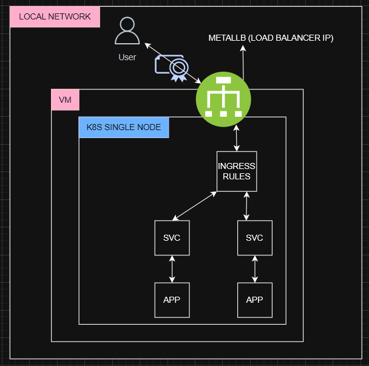

## Arquitetura



## Downloads

É necessário que a virtualização esteja ativada na BIOS/UEFI do seu computador para o correto funcionamento do ambiente.

virtualbox (win, linux ou macOS)
https://www.virtualbox.org/wiki/Downloads

vagrant (win, linux ou macOS)
https://developer.hashicorp.com/vagrant/install

## Passos para gerar e importar certificados

1. **Dar permissão de execução ao script**

   ```bash
   chmod +x generate_cert.sh
   ```

2. **Executar o script passando DNS e IP desejados**

   ```bash
   ./generate_cert.sh local 192.168.56.12
   ```
   Isso irá gerar os arquivos de certificado, chave, CA, etc.

3. **Configurar o arquivo hosts**

   - Abra o PowerShell como administrador.
   - Execute:
     ```powershell
     notepad C:\Windows\System32\drivers\etc\hosts
     ```
   - Adicione a linha abaixo ao arquivo e salve:
     ```
     192.168.56.12 meu.dominio.com
     ```
   - No linux  
     ```bash
     echo '192.168.56.12 meu.dominio.com' | sudo tee -a /etc/hosts
     ```

4. **Criar o Secret TLS no Kubernetes com os arquivos gerados**

   Considerando que seu certificado e chave foram gerados como `nginx.local.crt` e `nginx.local.key` (substitua conforme o nome gerado):

   ```bash
   kubectl create secret tls local-tls --cert=nginx.local.crt --key=nginx.local.key
   ```

5. **Copiar os arquivos CA para a pasta compartilhada para importação no browser**

   ```bash
   cp myCA.crt /vagrant_data/
   ```

6. **Importar o CA no browser (exemplo no Windows)**

   - Copie o arquivo `myCA.crt` para seu browser